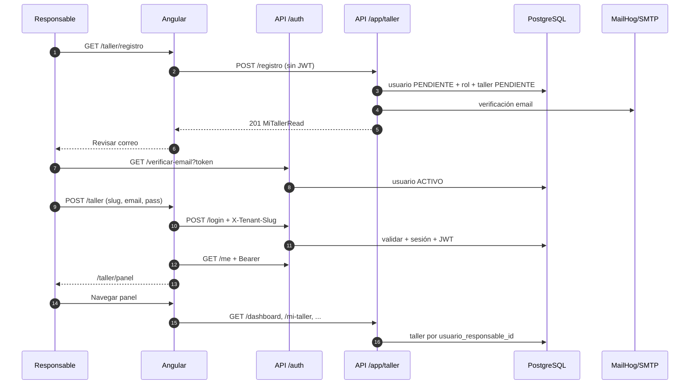

# Flujos — Portal web taller (`/taller`)

**Última actualización:** 2026-05-28  
**Alcance:** Alta pública de taller, login, panel responsable y contraste con admin SaaS.  
**Evidencia:** código en `frontend/src/app/taller/`, `backend/app/modules/talleres_y_tecnicos/taller_responsable/`, `backend/app/modules/acceso_y_administracion/auth/`.

---

## 1. Resumen ejecutivo

| Pregunta | Respuesta en el repo actual |
|----------|----------------------------|
| ¿Se crea el taller al hacer login en `/taller`? | **No.** El login solo autentica. |
| ¿Dónde se crea el taller? | **`/taller/registro`** → `POST /api/app/taller/registro` (público, sin JWT). |
| ¿Una cuenta puede tener varios talleres? | **No.** `talleres.usuario_responsable_id` es **UNIQUE** (1 responsable = 1 taller). |
| ¿Qué hace el panel tras login? | Opera el taller existente: bandeja, técnicos, `mi-taller` (editar), dashboard. |
| ¿Admin crea talleres distinto? | **Sí.** `POST /api/talleres/` con responsable ya existente + `tenant_id`. |

---

## 2. Rutas Angular

Prefijo app: `/taller` (`frontend/src/app/taller/taller.routes.ts`).

| Ruta | Componente | Auth |
|------|------------|------|
| `/taller` | `TallerLoginComponent` | No |
| `/taller/registro` | `TallerRegisterComponent` | No (público) — requiere `tenant_slug` |
| `/taller/recuperar` | `TallerRecoverComponent` | No |
| `/taller/restablecer-contrasena` | `TallerResetPasswordComponent` | No |
| `/taller/panel` | `TallerShellComponent` + hijos | `tallerAuthGuard` |
| `/taller/panel/mi-taller` | `TallerMiTallerComponent` | Sí |
| `/taller/panel/tecnicos` | `TallerTecnicosComponent` | Sí + permisos |
| `/taller/panel/emergencias/*` | Bandeja, detalle, historial… | Sí + `tallerPermisoGuard` |

Landing y navbar enlazan a `/taller/registro` (CTA) y `/taller` (ingresar).

---

## 3. Flujo A — Registro público (crear taller + responsable)

### 3.1 Actor y precondiciones

- **Actor:** futuro responsable de taller (sin sesión).
- **Precondición:** email/teléfono no duplicados **dentro del tenant** elegido; organización en estado `ACTIVO`.

### 3.2 Frontend

1. Usuario abre `/taller/registro` (opcional `?org=demo-sc`).
2. Selecciona **organización SaaS** + datos del taller, responsable y contraseña.
3. `TallerApiService.registro()` → `POST ${apiUrl}/app/taller/registro` con `tenant_slug` en body.
4. **No** se envía `Authorization` (interceptor marca el POST como público).

Archivos:

- `frontend/src/app/taller/features/auth/taller-register/taller-register.component.ts`
- `frontend/src/app/core/services/taller-api.service.ts`
- `frontend/src/app/core/interceptors/api-auth.interceptor.ts` (excepción `isPublicRegistro`)

### 3.3 Backend (orden de operaciones)

Endpoint: `POST /api/app/taller/registro` → `registro_taller_publico()` en  
`backend/app/modules/talleres_y_tecnicos/taller_responsable/service.py`.

| Paso | Acción | Estado / dato |
|------|--------|----------------|
| 1 | Resolver `tenant_slug` → org `ACTIVO` | 404/403 si no válida |
| 2 | `create_usuario` con `tenant_id` | `estado = PENDIENTE` |
| 3 | Asignar rol `TALLER_RESPONSABLE` | `usuario_roles` |
| 4 | Bitácora registro | módulo `taller_responsable` |
| 5 | `create_taller` con `tenant_id` | `estado = PENDIENTE` |
| 6 | `crear_y_enviar_verificacion_email` | enlace 72 h |
| 7 | Respuesta `MiTallerRead` | `pendiente_verificacion_email: true` |

### 3.4 Post-registro (UI)

- Mensaje: revisar correo (MailHog en dev: URL en `environment.mailhogWebUrl`).
- Enlace a `/taller` para login **después** de activar.

### 3.5 Activación de cuenta

- `GET /api/auth/verificar-email?token=...` → usuario `PENDIENTE` → `ACTIVO`.
- Sin este paso, el login devuelve **403** (“Cuenta pendiente de verificación”).

---

## 4. Flujo B — Login en `/taller`

### 4.1 Frontend

1. Formulario: **org slug** (default `demo-sc`), email, password, remember.
2. `TenantSlugService.set(orgSlug)`.
3. `TallerAuthService.login()`:
   - `POST /api/auth/login` con header **`X-Tenant-Slug`**.
   - `GET /api/auth/me` con Bearer.
4. Validación cliente: `me.roles` debe incluir **`TALLER_RESPONSABLE`**; si no → `TallerAuthError` FORBIDDEN_ROLE.
5. Persistencia: `ev_taller_access`, `ev_taller_refresh`, `ev_taller_me` en `localStorage` o `sessionStorage`.
6. Navegación: `/taller/panel`.

Archivos:

- `frontend/src/app/taller/features/auth/taller-login/taller-login.component.ts`
- `frontend/src/app/core/services/taller-auth.service.ts`
- `frontend/src/app/core/services/tenant-slug.service.ts`

### 4.2 Backend login

`backend/app/modules/acceso_y_administracion/auth/service.py` → `login()`:

| Validación | Efecto |
|------------|--------|
| Email/password incorrectos | 401 |
| `X-Tenant-Slug` y `user.tenant_id` distintos (si user tiene tenant) | 401 “Credenciales incorrectas” |
| `user.estado == PENDIENTE` | 403 verificación email |
| `user.estado != ACTIVO` | 403 |
| OK | JWT con claims `roles`, `tenant_id`, `jti`; sesión en BD |

RLS: `set_config('app.bypass_rls', 'on')` solo durante la transacción de login.

### 4.3 Guard del panel

`tallerAuthGuard`: `hydrateMeIfNeeded()` → exige token + rol `TALLER_RESPONSABLE`.  
**No** crea ni busca taller; solo autoriza entrada al shell.

---

## 5. Flujo C — Panel (sesión activa)

### 5.1 Resolución de contexto en API

Dependencia `require_taller_responsable` (`taller_responsable/router.py`):

1. Usuario autenticado + permisos (`get_current_user_permisos`).
2. Rol `TALLER_RESPONSABLE` en `usuario_roles`.
3. `SELECT taller WHERE usuario_responsable_id = user.id` → si no hay fila: **403** “No hay taller asociado a tu cuenta”.

### 5.2 Endpoints principales (prefijo `/api/app/taller`)

| Método | Ruta | Función |
|--------|------|---------|
| GET | `/dashboard` | KPIs técnicos, estado taller |
| GET/PUT | `/mi-taller` | Leer/actualizar perfil taller y datos responsable |
| GET/POST/PUT | `/tecnicos` | CRUD técnicos del taller |
| — | `/emergencias/...` | Módulo atención (bandeja, etc.) — otros routers |

`mi-taller` **no** crea taller; solo actualiza el vinculado al `usuario_id` de la sesión.

### 5.3 Interceptor HTTP

Para URLs bajo `/api/app/taller/*` (excepto POST `/registro`), se adjunta  
`Authorization: Bearer <ev_taller_access>` desde `TallerAuthService`.

---

## 6. Flujo D — Admin crea taller (contraste)

| Aspecto | Portal `/taller/registro` | Admin `/admin` (legacy) | Admin `/admin` **provision** |
|---------|---------------------------|---------------------------|------------------------------|
| API | `POST /api/app/taller/registro` | `POST /api/talleres/` | **`POST /api/talleres/provision`** |
| Auth | Ninguna | JWT admin | JWT admin |
| Crea usuario | Sí (responsable nuevo) | No (elige `usuario_responsable_id`) | **Sí (responsable nuevo, ACTIVO)** |
| `tenant_id` | **Sí** — `tenant_slug` en body → resuelve org activa | Obligatorio (superadmin) o `ctx.tenant_id` | Obligatorio |
| Rol | Asigna `TALLER_RESPONSABLE` | Responsable ya debe existir | Asigna `TALLER_RESPONSABLE` |
| Email verificación | Sí (usuario PENDIENTE) | Depende de cómo se creó el usuario | **No** (login inmediato en `/taller`) |

Frontend admin: `admin-talleres.component.ts` → `AdminApiService.provisionTaller()`. Menú **Usuarios** retirado del sidebar; altas de responsable solo vía Talleres.

Documentación SaaS admin: `docs/ai/sessions/2026-05-28-agent-saas-admin-usuarios-talleres.md`, sesión `2026-06-04-agent-admin-provision-taller.md`.

---

## 7. Multi-tenant (SaaS) — implicaciones

| Momento | Organización | `tenant_id` en BD |
|---------|--------------|-------------------|
| Registro público | `tenant_slug` en body + selector UI | Asignado a usuario y taller |
| Login `/taller` | `X-Tenant-Slug` (campo organización) | Validación si `user.tenant_id IS NOT NULL` |
| Seeds demo | `demo-sc` | Usuarios/talleres con `tenant_id` del demo |
| Admin alta taller | N/A (JWT + contexto) | `tenant_id` explícito en body |

**Resuelto (2026-06-05):** auto-registro asocia `tenant_id` vía `tenant_slug`; login debe usar la misma organización.

---

## 8. Diagrama de secuencia (registro → login → panel)

---

## 9. Prueba de escritorio rápida

### 9.1 Camino registro completo

| # | Acción | Esperado |
|---|--------|----------|
| 1 | `/taller/registro` + datos nuevos | 201, success UI |
| 2 | Abrir enlace en MailHog | Usuario ACTIVO |
| 3 | `/taller` slug + credenciales | 200, redirect panel |
| 4 | `/taller/panel/mi-taller` | Datos del taller creado |

### 9.2 Camino seed (sin registro)

| # | Acción | Esperado |
|---|--------|----------|
| 1 | `/taller`, org `demo-sc`, `patricio.mendez@sc-demo.test` / `scdemo1` | Panel OK |
| 2 | Bandeja emergencias | Datos `[DEMO-SC]` si seeds aplicados |

---

## 10. Trazabilidad PUDS (borrador)

| RF / CU (conceptual) | Módulo backend | UI |
|--------------------|----------------|-----|
| Registrar taller | `taller_responsable.service.registro_taller_publico` | `/taller/registro` |
| Activar cuenta | `auth` verificar email | Mail + link |
| Login responsable | `auth.service.login` | `/taller` |
| Gestionar mi taller | `taller_responsable` GET/PUT `mi-taller` | `/taller/panel/mi-taller` |
| Admin alta taller SaaS | `talleres.router.provisionar_taller` | `/admin/panel/talleres` |

Diagrama UML de secuencia sugerido en repo: `docs/diagrams/uml/sequence-auth-login-bce.puml` (login); **pendiente** secuencia dedicada `sequence-taller-registro-login.puml`.

---

## 11. Archivos clave (estudiar en orden)

1. `frontend/src/app/taller/taller.routes.ts`
2. `frontend/src/app/taller/features/auth/taller-register/taller-register.component.ts`
3. `frontend/src/app/taller/features/auth/taller-login/taller-login.component.ts`
4. `frontend/src/app/core/services/taller-auth.service.ts`
5. `backend/app/modules/talleres_y_tecnicos/taller_responsable/service.py` (`registro_taller_publico`)
6. `backend/app/modules/talleres_y_tecnicos/taller_responsable/router.py`
7. `backend/app/modules/acceso_y_administracion/auth/service.py` (`login`)
8. `backend/app/modules/talleres_y_tecnicos/talleres/models.py` (`Taller`, UNIQUE responsable)

---

## 12. Relacionado en `docs/ai/`

- `LANDING_REDESIGN_PLAN.md` — CTAs hacia `/taller/registro` y `/taller`
- `SAAS_PHASE3_PLAN.md` — tenants, slug, billing
- `sessions/2026-05-28-agent-saas-admin-usuarios-talleres.md` — admin usuarios/talleres
- `sessions/2026-05-28-agent-landing-paleta-a-dark.md` — landing Paleta A
- `DECISIONS_LOG.md` — DEC-029 (separación registro vs login)
