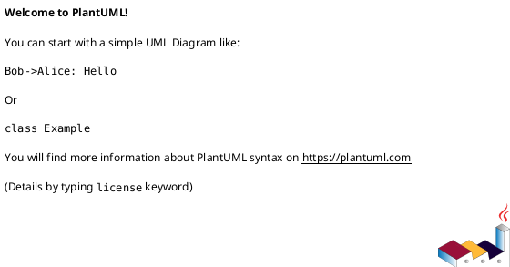

# CONVENTIONS — Nombres, archivos y render

## Nombres de archivo

```
c4/NN-nombre-corto.puml          ← NN = 01, 02 orden C4
uml/tipo-dominio-accion.puml     ← ej. sequence-emergencia-alta-cliente.puml
output/                          ← solo generados
output/ea/                       ← exports PNG desde EA (opcional)
```

## Encabezado obligatorio en cada `.puml`



## C4 (niveles)

| Nivel | Archivo esperado | Contenido |
|-------|------------------|-----------|
| 1 Context | `c4/01-context.puml` | Actores + sistema software |
| 2 Container | `c4/02-containers.puml` | Apps, API, BD, worker IA, externos |
| 3 Component | `c4/03-components-backend.puml` | Módulos FastAPI dentro del contenedor API |
| 4 Code | `c4/04-code-emergencias-alta.puml` | Clases de un CU (ej. CU11); UML 2.5 en detalle |

Includes estándar (requieren red la primera vez):

```plantuml
!include https://raw.githubusercontent.com/plantuml-stdlib/C4-PlantUML/master/C4_Context.puml
```

**Offline:** clonar C4-PlantUML en `docs/diagrams/lib/C4-PlantUML/` y usar:

```plantuml
!include ../lib/C4-PlantUML/C4_Context.puml
```

## UML 2.5

- **Paquetes:** un paquete por carpeta `app/modules/<dominio>/`.  
- **Secuencia:** `actor` / `participant` con alias; mensajes = endpoints HTTP o llamadas service reales.  
- **Despliegue:** nodos UML 2.5 (`«device»`, `«executionEnvironment»`, `«artifact»`); ver `agent-memory/DEPLOYMENT_DIAGRAM_UML_GUIDE.md`.  
- Relaciones: preferir `-->` con etiqueta breve; evitar más de ~12 participantes por diagrama.

## Trazabilidad PUDS

En comentario al final del `.puml`:

```plantuml
' Trazabilidad: CU11 → POST /api/app/cliente/emergencias
@enduml
```

Tabla maestra sugerida en `docs/ai/PACKAGE_DESIGN.md`.

## Enterprise Architect

- Mismo nombre de paquete que en código cuando sea posible.  
- Stereotypes UML estándar; evitar stereotypes custom sin glosario.  
- Sincronizar IDs EA en `EA_INTEGRATION.md` (diagramID, packageID) cuando se conozcan.

## ASCII

- Preferir `-utxt` sobre `-txt`.  
- Copiar fragmentos cortos al chat; archivos completos en `output/*.utxt`.
