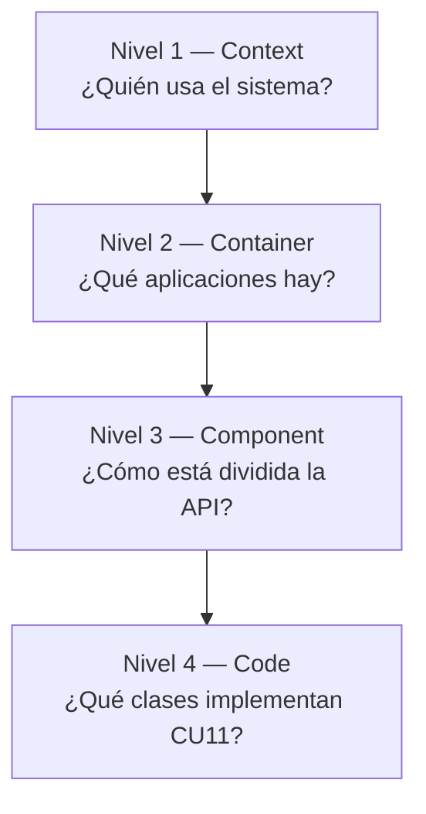

# Modelo C4 — Plataforma de emergencias vehiculares

Cuatro niveles de zoom (Simon Brown / [C4-PlantUML](https://github.com/plantuml-stdlib/C4-PlantUML)).

| Nivel | Nombre C4 | Archivo | ID | Qué muestra |
|-------|-----------|---------|-----|-------------|
| **1** | Context | [`01-context.puml`](01-context.puml) | D-001 | Actores + sistema software + externos |
| **2** | Container | [`02-containers.puml`](02-containers.puml) | D-002 | Apps, API, BD, worker IA, integraciones |
| **3** | Component | [`03-components-backend.puml`](03-components-backend.puml) | D-003c | Módulos dentro del contenedor **API** |
| **4** | Code | [`04-code-emergencias-alta.puml`](04-code-emergencias-alta.puml) | D-004c | Clases del flujo **CU11** (alta emergencia) |

## Jerarquía de zoom



## Render local

```powershell
cd docs\diagrams\c4
plantuml -png -o ..\output 01-context.puml 02-containers.puml 03-components-backend.puml 04-code-emergencias-alta.puml
```

## draw.io (MCP)

| C4 | Puente Mermaid |
|----|----------------|
| Context | `drawio/mermaid/01-context-c4.mmd` |
| Container | `drawio/mermaid/02-containers-c4.mmd` |
| Component | `drawio/mermaid/03-components-backend-c4.mmd` |
| Code | `drawio/mermaid/04-code-emergencias-c4.mmd` |

## Relación con UML

- **C4** = vistas de arquitectura por niveles (producto / deploy lógico).
- **UML despliegue** = infra física (`uml/deployment-docker-azure.puml`) — no mezclar con C4 Container.
- **UML paquetes** = diseño lógico backend (`uml/packages-backend-logical.puml`) — complementa nivel 3.
